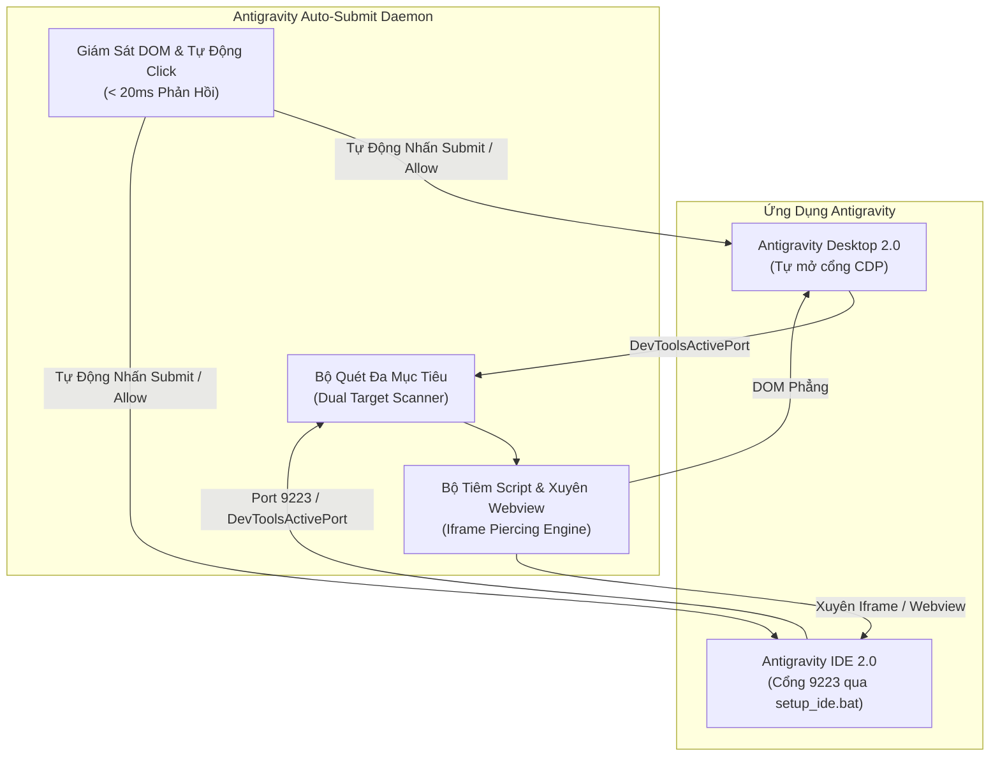

# 🚀 Antigravity Auto-Submit Daemon (Dual-Engine)

Chương trình tự động hóa việc nhấn nút **`Submit` / `Allow`** để phê duyệt lệnh terminal mỗi khi AI Agent yêu cầu chạy lệnh an toàn (`Allow checking environment tools?...`), giúp Agent làm việc liên tục mà không cần người dùng phải bấm thủ công.

Hỗ trợ song song cả hai nền tảng:
- 📱 **Antigravity 2.0** (Ứng dụng máy tính độc lập - Electron Desktop App)
- 💻 **Antigravity IDE 2.0** (Môi trường lập trình AI-first trên nền VS Code)

---

## 🌟 Tính Năng Nổi Bật

1. **Hỗ trợ song song 2 ứng dụng (Dual-Engine)**:
   - Tự động nhận diện và kết nối đồng thời cả Antigravity Desktop và Antigravity IDE. Bạn có thể mở một trong hai hoặc mở cả hai cùng lúc, tool sẽ tự động bám theo và phê duyệt đúng cửa sổ yêu cầu.
2. **Hoàn toàn không chiếm chuột**: 
   - Chương trình kích hoạt sự kiện `.click()` trực tiếp ở tầng DOM thông qua Chrome DevTools Protocol (CDP).
   - Con trỏ chuột của bạn hoàn toàn tự do, không bị giật, bạn có thể gõ phím hoặc làm việc khác mà không bị ảnh hưởng.
3. **Xuyên Webview / Iframe (Iframe Piercing)**:
   - Đối với Antigravity IDE, các panel chat (Cascade/Jetski) thường nằm trong webview lồng nhau. Bộ tiêm script được nâng cấp để duyệt đệ quy qua tất cả các iframe và shadow DOM.
4. **Hoạt động ngầm (Background)**:
   - Tự động click ngay cả khi cửa sổ Antigravity hoặc Antigravity IDE bị che khuất hoặc thu nhỏ xuống Taskbar.
5. **Tốc độ phản ứng tức thì**:
   - Sử dụng `MutationObserver` kết hợp chu kỳ quét 100ms, tự động nhấn Submit trong vòng **dưới 20ms** kể từ khi bảng hiện lên.
6. **Không cần cài đặt thêm thư viện**:
   - Sử dụng 100% native API có sẵn của Node.js (`fetch`, `WebSocket`, `fs`), không cần chạy `npm install`.

---

## 🏛️ Sơ Đồ Kiến Trúc Hoạt Động (Dual-Engine)



---

## 📂 Danh Sách Tệp Trong Thư Mục

| Tệp | Mô tả |
| :--- | :--- |
| **`auto_submit.js`** | Mã nguồn chính của daemon Node.js (hỗ trợ đa mục tiêu) |
| **`setup_ide.bat`** | **[1-Click]** Kích hoạt cổng DevTools Protocol cho Antigravity IDE 2.0 |
| **`setup_ide.js`** | Script cấu hình tự động cho `~/.antigravity-ide/argv.json` |
| **`start_console.bat`** | Khởi động tool với cửa sổ Console (để theo dõi log trực tiếp) |
| **`start_silent.vbs`** | **[Khuyên dùng]** Khởi chạy tool ẩn hoàn toàn dưới nền (không hiện cửa sổ nào) |
| **`stop.bat`** | Dừng ngay lập tức dịch vụ auto-submit |
| **`setup_autostart.bat`** | Thêm tool vào thư mục Startup của Windows (tự chạy khi bật máy) |
| **`remove_autostart.bat`** | Hủy tự khởi động cùng Windows |
| **`auto_submit_visual.py`** | Script Python dự phòng (clicker màn hình theo hình ảnh, cần cài OpenCV) |

---

## 🛠️ Hướng Dẫn Thiết Lập Cho Antigravity IDE 2.0

Khác với bản Desktop App vốn tự động mở cổng ngầm, Antigravity IDE (trên nền VS Code) cần mở cổng DevTools Protocol một lần duy nhất:

1. **Nhấp đúp chuột vào tệp `setup_ide.bat`**.
   - Script sẽ tự động thêm cờ `"remote-debugging-port": "9223"` vào tệp cấu hình runtime `~/.antigravity-ide/argv.json` một cách an toàn.
2. **Khởi động lại Antigravity IDE**:
   - Tắt Antigravity IDE và mở lại để IDE áp dụng cổng mới.
3. Xong! Từ nay Auto-Submit Daemon sẽ tự động nhận diện cả Antigravity IDE mỗi khi IDE được bật.

---

## 🚀 Hướng Dẫn Sử Dụng Hàng Ngày

### Cách 1: Chạy ẩn dưới nền (Khuyên dùng)
- **Nhấp đúp chuột vào tệp `start_silent.vbs`**.
- Chương trình sẽ chạy ngầm hoàn toàn. Khi bất kỳ cửa sổ Antigravity 2.0 hoặc Antigravity IDE 2.0 nào hiện bảng hỏi phê duyệt lệnh, tool sẽ âm thầm nhấn `Submit` / `Allow` ngay lập tức!

### Cách 2: Chạy với cửa sổ Console (Để theo dõi log chi tiết)
- **Nhấp đúp chuột vào tệp `start_console.bat`**.
- Cửa sổ console sẽ hiện lên và hiển thị log trực tiếp:
  ```text
  [14:30:15] ✅ [Antigravity Desktop 2.0] Kết nối thành công (Port 59404)...
  [14:30:16] ✅ [Antigravity IDE 2.0] Kết nối thành công (Port 9223)...
  [14:35:10] ⚡ [Antigravity IDE 2.0] TỰ ĐỘNG PHÊ DUYỆT THÀNH CÔNG: Đã nhấn nút phê duyệt lệnh!
  ```

### Cách dừng chương trình:
- **Nhấp đúp chuột vào tệp `stop.bat`** bất kỳ lúc nào bạn muốn tạm dừng tự động hóa.

### Cài đặt tự khởi động khi bật máy tính:
- **Nhấp đúp chuột vào tệp `setup_autostart.bat`**.
- Tool sẽ được đặt vào thư mục `shell:startup` của Windows. Mỗi khi bạn bật máy, tool sẽ tự động chạy ngầm phục vụ cả hai ứng dụng.

---

## 🛡️ Cơ Chế An Toàn & Tránh Bấm Nhầm
- Chương trình chỉ kích hoạt khi xác nhận có nút `Submit` / `Allow` nằm cạnh nút `Skip`/`Deny`/`Cancel` hoặc khi trang có chứa nội dung hộp thoại phê duyệt lệnh (`allow this time`, `Allow checking`, `tell the agent what to do instead`, `Do you want to run`, `requires your approval`).
- Các nút chức năng khác trên giao diện (nút Settings, chọn model, gửi chat, chỉnh code trong editor) hoàn toàn không bị ảnh hưởng.
- Có cơ chế **Cooldown (1.5 giây)** để tránh bị click đúp hoặc lặp lệnh liên tiếp.

---

## ⚠️ Lưu Ý An Toàn & Bảo Mật (Security Disclaimer)

- **Bản chất hoạt động**: Hộp thoại xác nhận của Antigravity là lớp bảo vệ nhằm ngăn AI agent tự ý chạy các lệnh terminal ngoài ý muốn hoặc có thể làm thay đổi hệ thống. Công cụ này sẽ tự động nhấn `Submit` để bypass hộp thoại xác nhận đó.
- **Khuyến nghị sử dụng**: Bạn chỉ nên bật công cụ này khi làm việc trên các dự án an toàn, môi trường phát triển (development/sandbox) đáng tin cậy hoặc khi bạn đã thiết lập kiểm soát phiên bản (Git).
- **Kiểm soát thủ công**: Nếu đang thực hiện các thao tác nhạy cảm (như migration dữ liệu, xoá file hàng loạt, thao tác production), hãy nhấp đúp vào `stop.bat` để dừng công cụ và quay về cơ chế phê duyệt thủ công.
